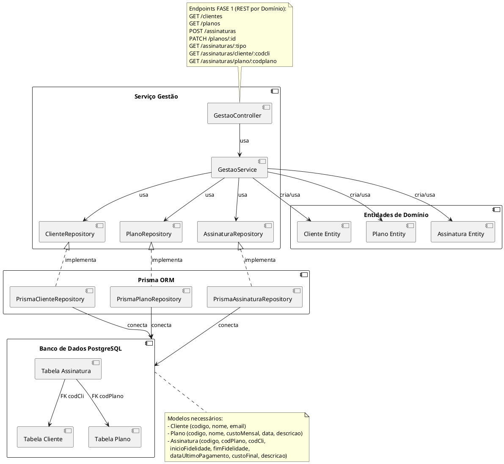

# 🏢 Serviço de Gestão - Sistema de Operadora

> **Projeto da FASE 1**: Sistema de gestão de clientes, planos e assinaturas para operadora de telecomunicações, desenvolvido com NestJS, Prisma e PostgreSQL seguindo os princípios da Arquitetura Limpa.


## 🏗️ Arquitetura do Sistema

Este projeto foi desenvolvido seguindo os princípios da **Clean Architecture** (Arquitetura Limpa) proposta por Robert C. Martin, organizando o código em camadas bem definidas com responsabilidades específicas e baixo acoplamento.

### Camadas da Aplicação

```
┌─────────────────────────────────────────┐
│     HTTP Layer (Controllers)            │  ← Camada de Apresentação
│  ClienteController | PlanoController    │    (Controllers específicos)
│  AssinaturaController | GestaoController│    
├─────────────────────────────────────────┤
│    Application Layer (Use Cases)        │  ← Camada de Aplicação
│  ClienteService | PlanoService          │    (Services por domínio)
│  AssinaturaService                      │
├─────────────────────────────────────────┤
│       Domain Layer (Entities)           │  ← Camada de Domínio
│  Cliente | Plano | Assinatura           │    (Entidades + Repositories)
│  + Repository Interfaces                │
├─────────────────────────────────────────┤
│    Infrastructure Layer (Database)      │  ← Camada de Infraestrutura
│  Repository Implementations             │    (Prisma + Converters)
│  + Data Converters                      │
└─────────────────────────────────────────┘
```

## 📊 Diagrama UML

- [PlantUML](https://www.plantuml.com/plantuml/uml/VPN1RXCz4CVl-nJpzVA1b3RY6Y7KaAO5qTAIf0ymjPt8qgvdPJi8L7WOr4DFd11Fi2_6six6TkJcKgt_ynlxxvbnSsuiQhjjwke_BjPI2LZCPwlfvwlhER0QZQcg_-72HQJY16I0KTEI4ieA0wsMYiaMfQdsCfmiXVugksU2As5izqGdW0QyoCX9IF1O0IGPGPsHifhgMcYV4PSbEEmdahr5ZirgwKmkH4j6MjBVFPgeENvNew83UA_bwDGOgT1kDHxmUQ3wwMetIyh51KYrrYYCrLk7fLLxZugHGowGKtys6RlHOldbsc_jeo5oKBiLFeWQXujvE4WxfKI7coMiNnV9UAS4ZwAxP5f5BKs3SBkuyNHOHiSfLEvF5Ykb5ViK8wMK5_jr60uTcoihEVBGBqvDzrj9IY-P0HS12CMCaSVYC7h0PfCObC8ifgmNIcJqdk9H3MAurqBKo2GfRFfKCj3_rG8ODiZHLF6rmUdfk-59mGIs1gjXvI99tmhHq9voBDgAW3FsiMbhuKnXzzpzTMKb0pgqglkZ9PagFVJjZxEpR4wSIxdVeueM4jABEPVQoU4OoJB2SrRYM_T4hWdmu1vbbLe95qqUwwG7bM1zSkhZE9IUNoQ3btj3mD606AQkrASm0IvHInmNstKSoOSfvmfJfMXNbkG_HRnA46FRBZy18zwlZ-53xmBiL-xagQ9iOeJYBKbbJTK715XgWTRvhyXyGE1okfp3cqclNSrNCDxutvGn2yRCWTow8vruTxkCAkwz-j1qDVjma36Uo60tx5V8x14hsoFndQFnX17llry6_OaUyr-LK1nS7QfGZGUobXfNa3XD5S0DSL6xhWacZEb-kSVcYd8AGuzUCU9oGoDGr8WHY0Pb_TeJeIq7SROrbcw4CbYFWAF5_gymJ4k65D9YYsFkqDRHRXf6qAC0KaacwLBs7ls0Zs0jcxWCb3_blhQoeJlSX34CFlfCXNLc85RblF_SDlK_)



## 🎯 Princípios SOLID

A aplicação foi desenvolvida seguindo rigorosamente os cinco princípios SOLID:

### **S - Single Responsibility Principle (SRP)**
Cada classe possui uma única responsabilidade:
- **Controllers**: Apenas manipulam requisições HTTP
- **Services**: Contêm apenas lógica de negócio
- **Repositories**: Responsáveis apenas pela persistência de dados
- **Entities**: Representam apenas as regras de negócio do domínio

```typescript
// Exemplo: ClienteController tem apenas a responsabilidade de lidar com HTTP
@Controller('clientes')
export class ClienteController {
  constructor(private readonly clienteService: ClienteService) {}
  
  @Get()
  listarTodos() {
    return this.clienteService.listarTodos(); // Delega para o service
  }
}
```

### **O - Open/Closed Principle (OCP)**
As classes estão abertas para extensão e fechadas para modificação:
- Uso de **interfaces abstratas** para repositórios
- Possibilidade de adicionar novas implementações sem modificar código existente

```typescript
// Interface abstrata - fechada para modificação
export abstract class ClienteRepository {
  abstract listarTodos(): Promise<Cliente[]>;
}

// Implementação concreta - aberta para extensão
export class PrismaClienteRepository implements ClienteRepository {
  async listarTodos(): Promise<Cliente[]> {
    // Implementação específica do Prisma
  }
}
```

### **L - Liskov Substitution Principle (LSP)**
Implementações concretas podem substituir suas abstrações sem quebrar a funcionalidade:
- `PrismaClienteRepository` pode substituir `ClienteRepository`
- `PrismaPlanoRepository` pode substituir `PlanoRepository`

### **I - Interface Segregation Principle (ISP)**
Interfaces específicas e coesas, sem métodos desnecessários:
- Cada repository possui apenas os métodos necessários para sua entidade
- DTOs específicos para cada operação

### **D - Dependency Inversion Principle (DIP)**
Dependência de abstrações, não de implementações:
- Services dependem de interfaces abstratas dos repositories
- Injeção de dependência configurada no módulo

```typescript
@Injectable()
export class ClienteService {
  constructor(
    private clienteRepository: ClienteRepository, // Abstração, não implementação
  ) {}
}
```

## 🎨 Padrões de Projeto

### **Repository Pattern**
Abstrai a lógica de acesso a dados, permitindo trocar implementações sem afetar a lógica de negócio.

```
Domain Layer (Abstract)     →     Infrastructure Layer (Concrete)
ClienteRepository          →     ClienteRepositoryImpl
PlanoRepository            →     PlanoRepositoryImpl  
AssinaturaRepository       →     AssinaturaRepositoryImpl
```

### **Dependency Injection**
Utilizado pelo NestJS para gerenciar dependências e garantir baixo acoplamento.

### **Data Transfer Object (DTO)**
Objetos específicos para transferência de dados entre camadas:
- `CriarAssinaturaDto`: Para criação de assinaturas
- `AssinaturaListDto`: Para listagem de assinaturas

### **Entity Pattern**
Entidades de domínio encapsulam regras de negócio:

```typescript
export class Assinatura {
  isAtiva(): boolean {
    const hoje = new Date();
    return this.dataUltimoPagamento >= 
      new Date(hoje.getTime() - 30 * 24 * 60 * 60 * 1000);
  }
}
```

## 🌐 Endpoints da API

| Método | Endpoint | Descrição | Parâmetros | Resposta |
|--------|----------|-----------|------------|----------|
| `GET` | `/clientes` | Lista todos os clientes | Nenhum | Array com todos os atributos da entidade |
| `GET` | `/planos` | Lista todos os planos | Nenhum | Array com todos os atributos da entidade |
| `POST` | `/assinaturas` | Cria uma assinatura | `{codCli, codPlano, custoFinal, descricao}` | Objeto com todos os atributos da assinatura |
| `PATCH` | `/planos/:id` | Atualiza custo mensal do plano | `{custoMensal}` | Objeto com todos os atributos do plano |
| `GET` | `/assinaturas/:tipo` | Lista assinaturas por tipo | `tipo: TODOS\|ATIVOS\|CANCELADOS` | Array de objetos com status |
| `GET` | `/clientes/:codcli/assinaturas` | Lista assinaturas do cliente | `codcli: número` | Array de objetos com status |
| `GET` | `/planos/:codplano/assinaturas` | Lista assinaturas do plano | `codplano: número` | Array de objetos com status |

## 🧪 Testes da API

### **Documentação Completa de Testes**

Para facilitar os testes e validação dos endpoints, foram criados dois arquivos dedicados:


### **📦 Collection do Postman**

- **Arquivo:** `TESTES-API.postman_collection.json`
- **Conteúdo:** Collection completa com todos os 7 endpoints da FASE 1
- **Como testar?:** Vá em "import" e insira o arquivo. 

### **Verificação Rápida**

```bash
# Teste básico para verificar se a API está funcionando
curl http://localhost:3000/clientes

# Deve retornar array JSON com clientes
```

## 🚀 Instalação e Execução

### **Pré-requisitos**

- [Git](https://git-scm.com/)
- [Docker](https://www.docker.com/get-started/) e Docker Compose
- [Node.js](https://nodejs.org/en/) e NPM (opcional, para desenvolvimento)

### **Passo a Passo**

#### **1. Clonar o Repositório**

```bash
git clone <URL_DO_SEU_REPOSITORIO>
cd servico-gestao
```

#### **2. Configurar Variáveis de Ambiente**

Crie o arquivo `.env` na raiz do projeto:

```env
# Configurações do PostgreSQL
POSTGRES_USER=docker
POSTGRES_PASSWORD=docker
POSTGRES_DB=servico_gestao
POSTGRES_PORT=5432
```

#### **3. Iniciar os Containers**

```bash
docker-compose up --build
```

> - ✅ Migrações aplicadas automaticamente
> - ✅ Banco populado com dados de teste
> - ✅ Aplicação iniciada

#### **4. Testar a API**

```bash
curl http://localhost:3000/clientes
```

### **Comandos Úteis**

```bash
# Parar todos os serviços
docker-compose down

# Ver logs em tempo real
docker-compose logs -f backend

# Resetar banco de dados (recria tudo)
docker-compose down -v
docker-compose up --build
```

## 📁 Estrutura do Projeto

```
src/
├── main.ts                           # Entry point da aplicação
├── app.module.ts                     # Módulo principal
├── cliente.module.ts                 # Módulo de clientes
├── plano.module.ts                   # Módulo de planos
├── assinatura.module.ts              # Módulo de assinaturas
├── gestao.module.ts                  # Módulo de gestão (endpoints compostos)
├── prisma.service.ts                 # Serviço do Prisma
│
├── application/                      # Camada de Aplicação
│   └── use-cases/                    # Casos de uso específicos
│       ├── cliente.service.ts        # Lógica de negócio - Clientes
│       ├── plano.service.ts          # Lógica de negócio - Planos
│       └── assinatura.service.ts     # Lógica de negócio - Assinaturas
│
├── domain/                           # Camada de Domínio
│   ├── entities/                     # Entidades de negócio
│   │   ├── cliente.entity.ts
│   │   ├── plano.entity.ts
│   │   └── assinatura.entity.ts
│   └── repositories/                 # Interfaces dos repositórios
│       ├── cliente.repository.ts
│       ├── plano.repository.ts
│       └── assinatura.repository.ts
│
├── infrastructure/                   # Camada de Infraestrutura
│   ├── http/                         # Controllers (REST API)
│   │   ├── cliente.controller.ts     # Endpoints de clientes
│   │   ├── plano.controller.ts       # Endpoints de planos
│   │   ├── assinatura.controller.ts  # Endpoints de assinaturas
│   │   └── gestao.controller.ts      # Endpoints compostos
│   └── database/                     # Implementações dos repositórios
│       ├── cliente.repository.impl.ts
│       ├── cliente.converter.ts      # Conversão Entity ↔ Prisma
│       ├── plano.repository.impl.ts
│       ├── plano.converter.ts
│       ├── assinatura.repository.impl.ts
│       └── assinatura.converter.ts
│
└── shared/                           # Recursos compartilhados
    └── constants/                    # Constantes do sistema
        ├── index.ts
        └── time.constants.ts

prisma/
├── schema.prisma                     # Schema do banco de dados
└── seed.ts                           # Script de população inicial
```

## 🛠️ Tecnologias Utilizadas

### **Backend**
- **[NestJS](https://nestjs.com/)**: Framework Node.js para aplicações escaláveis
- **[TypeScript](https://www.typescriptlang.org/)**: Linguagem com tipagem estática
- **[Prisma](https://www.prisma.io/)**: ORM moderno para TypeScript/Node.js

### **Banco de Dados**
- **[PostgreSQL](https://www.postgresql.org/)**: Banco de dados relacional robusto

### **DevOps**
- **[Docker](https://www.docker.com/)**: Containerização da aplicação
- **[Docker Compose](https://docs.docker.com/compose/)**: Orquestração de containers

### **Desenvolvimento**
- **[ESLint](https://eslint.org/)**: Linting de código
- **[Prettier](https://prettier.io/)**: Formatação automática
- **[Jest](https://jestjs.io/)**: Framework de testes

## 📝 Conclusão

### **Desenvolvimento da FASE 1**

O desenvolvimento desta fase foi focado na criação de uma base sólida para o sistema de gestão da operadora, priorizando:

1. **Arquitetura Limpa**: Separação clara de responsabilidades entre camadas
2. **Princípios SOLID**: Aplicação rigorosa dos cinco princípios
3. **Separação por Domínio**: Services e Controllers específicos para cada entidade
4. **Testabilidade**: Código desacoplado e facilmente testável
5. **Manutenibilidade**: Estrutura organizada e extensível

### **Arquitetura Implementada**

A aplicação seguiu uma abordagem híbrida, combinando:

- **Controllers por Domínio**: `ClienteController`, `PlanoController`, `AssinaturaController`
- **Controller Composto**: `GestaoController` para endpoints que cruzam domínios
- **Services Especializados**: Cada entidade possui seu próprio service
- **Repositories com Converters**: Separação entre entidades de domínio e modelos de dados

### **Padrão de Converters**

Foi implementado um padrão de conversão entre as entidades de domínio e os modelos do Prisma:

```typescript
// Exemplo do ClienteConverter
export class ClienteConverter {
  static toEntity(prismaCliente: PrismaCliente): Cliente {
    // Converte modelo Prisma para entidade de domínio
  }
  
  static toPrisma(cliente: Cliente): PrismaCliente {
    // Converte entidade de domínio para modelo Prisma
  }
}
```

Este padrão garante que:
- A camada de domínio permaneça independente do ORM
- As regras de conversão fiquem centralizadas
- Seja fácil trocar o ORM no futuro

### **Desafios Encontrados e Soluções**

#### **1. Modelagem do Banco de Dados**
**Desafio**: Definir relacionamentos entre Cliente, Plano e Assinatura de forma eficiente.

**Solução**: Utilizou-se chaves estrangeiras para manter integridade referencial e campos calculados para status das assinaturas.

**Referência**: [Prisma Relations](https://www.prisma.io/docs/concepts/components/prisma-schema/relations)

#### **2. Implementação do Repository Pattern**
**Desafio**: Abstrair a camada de dados mantendo flexibilidade para mudanças futuras.

**Solução**: Criação de interfaces abstratas na camada de domínio com implementações concretas na infraestrutura.

**Referência**: [Repository Pattern - Martin Fowler](https://martinfowler.com/eaaCatalog/repository.html)

#### **3. Gerenciamento de Status das Assinaturas**
**Desafio**: Determinar se uma assinatura está ativa ou cancelada baseada em regras de negócio.

**Solução**: Implementação de lógica na entidade de domínio e nos repositórios, considerando o último pagamento (30 dias).

#### **4. Containerização com Docker**
**Desafio**: Configurar ambiente de desenvolvimento reproduzível e fácil de executar.

**Solução**: Docker Compose com serviços separados para aplicação e banco de dados, incluindo scripts de inicialização.

**Referência**: [NestJS with Docker](https://docs.nestjs.com/recipes/prisma#docker)

#### **5. Modularização por Domínio**
**Desafio**: Organizar o código de forma que cada domínio tenha suas responsabilidades bem definidas.

**Solução**: Criação de módulos, services e controllers específicos para cada entidade (Cliente, Plano, Assinatura), com um módulo de gestão para operações que cruzam domínios.

**Referência**: [NestJS Modules](https://docs.nestjs.com/modules)

#### **6. Padrão Converter**
**Desafio**: Manter a independência entre as entidades de domínio e os modelos do banco de dados.

**Solução**: Implementação de classes converter que fazem a tradução entre entidades de domínio e modelos Prisma, mantendo as camadas desacopladas.

#### **7. Seed de Dados para Testes**
**Desafio**: Criar dados de teste realistas para validação dos endpoints.

**Solução**: Script de seed automatizado com dados variados (assinaturas ativas e canceladas).

**Referência**: [Prisma Seeding](https://www.prisma.io/docs/guides/database/seed-database)


### **Referências Técnicas**

- [Clean Architecture - Robert C. Martin](https://blog.cleancoder.com/uncle-bob/2012/08/13/the-clean-architecture.html)
- [SOLID Principles](https://medium.com/backticks-tildes/the-s-o-l-i-d-principles-in-pictures-b34ce2f1e898)
- [NestJS Documentation](https://docs.nestjs.com/)
- [Prisma Best Practices](https://www.prisma.io/docs/guides/performance-and-optimization)
- [TypeScript Handbook](https://www.typescriptlang.org/docs/)

---

> **Desenvolvido por**: Gabriela de Castro Laurindo  
> **Instituição**: PUCRS - Desenvolvimento de Sistemas Backend  
> **Data**: Agosto de 2025